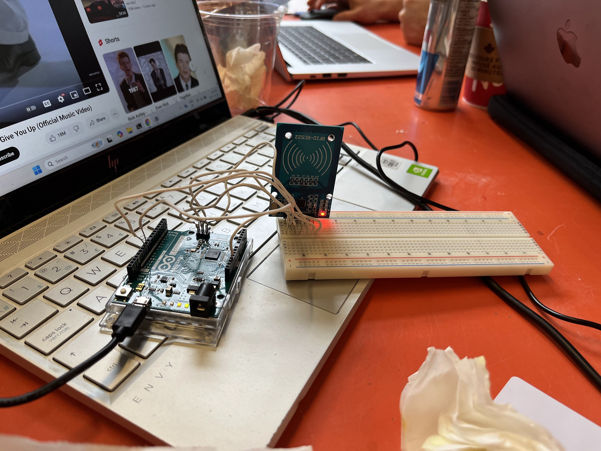

# N factor authentication system

A more secure multi factor authentication system, where N is a real number.

# Auth flow

1. Email / Password auth
2. Math problem
3. Captcha
4. tic tac toe
5. RFID
6. Vote
7. Login!

# Contributors

- [@Channertheman](https://github.com/Channertheman) + [@shawnyu5](https://github.com/shawnyu5) built the frontend
- [@gathris](https://github.com/gathris) built parts of the Frontend and made it look pretty
- [@gingertastrophe](https://github.com/gingertastrophe) built the RFID Arduino module and wrote the code for it

